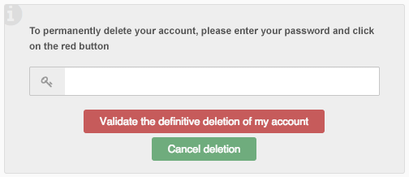

react-confirmation-box
=======================

A ReactJS component that create a confirmation box.

For example, you can display a confirmation box like this:

Screen 1:

Screen 2:

Getting started:
---------------------

##### Install:

`npm install react-confirmation-box`

##### To load the component:

`var DynamicFields = require("react-confirmation-box");`
